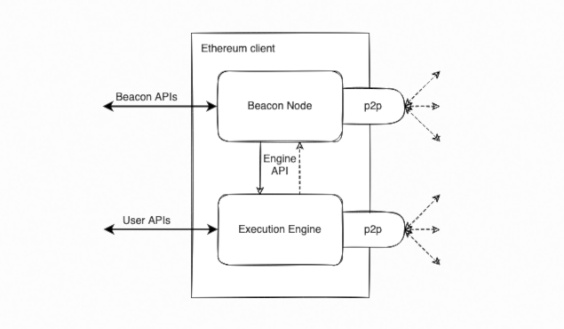

## Kintsugi Challenge - Container Native Joining And Running Nodes On The Testnet

The idea is to improve upon simplification of Deployment/Orchestration of _LOCAL ETH-TOOLS_ and make them more Container Native while cementing the concept of disposable ETH_ENV(s). The focus is on dockerization scripts,process,tools and use-cases of k8s and existing docker native toolkit setup. Initial goal(s) are :-
1. To port Ethereum Tools Helm Charts from DigitalOcean based k8s into a local Minikube installation.
2. To combine docker-compose files of multiple Consensus Layer(CL) + Execution Layer(El) clients into a simplified Docker Swarm/Compose structure and create/use a separate isolated network from the host network.
3. Introduce Jenkins CI installed as a JENKINS k8s OPERATOR to provide _LOCAL DEV-ENV/TEST-ENV_ with a pluggable process/task automation tool.

#### Tech Stack/Prerequisites And Assumptions

- Main tools are Terraform And Ansible For IaC to provision environment and manage Docker image generation
- Ansible playbooks to setup Minikube and Docker Swarm/Compose
- Standardized Dockerfile(s) for building CL + EL docker images
- Jenkins Pipelines to automate image generation/facilitate general task automation, customized Testing capabilities. 
- Linux/Ubuntu Based DEV, STG And PROD ENV
- CL + EL clients running on the ETH Node/deployed combination of the clients as per Kintsugi Testnet

#### How To Run This PoC

- To start, clone the repo into a work env folder of choice
```bash
git clone git@github.com:gluzangi/ethereum-tools-iac.git

cd ./ethereum-tools-iac
```

- Prepare docker containerization and orchestration environment 

1. Run ansible playbooks to set _LOCAL DEV-ENV/TEST-ENV_ with ETH-TOOLS + other complementary tools
```bash
#! /bin/bash
#
# To do a dry run use :
#
# ANSIBLE_HOST_KEY_CHECKING=False ansible-playbook -i cluster.nodes -C -K playbook.yml
#
cd ./ansible-local && ANSIBLE_HOST_KEY_CHECKING=False ansible-playbook -i cluster.nodes -K playbook.yml
```

2. Setup your kubernetes cluster and launch a _LOCAL DEV-ENV/TEST-ENV_ :
```bash
minikube start --cni cilium -p ethereum
😄  [ethereum] minikube v1.24.0 on Linuxmint 20.2
✨  Using the docker driver based on user configuration
👍  Starting control plane node ethereum in cluster ethereum
🚜  Pulling base image ...
🔥  Creating docker container (CPUs=2, Memory=4096MB) ...

🐳  Preparing Kubernetes v1.22.3 on Docker 20.10.8 ...
    ▪ Generating certificates and keys ...
    ▪ Booting up control plane ...
    ▪ Configuring RBAC rules ...
🔗  Configuring Cilium (Container Networking Interface) ...
🔎  Verifying Kubernetes components...
    ▪ Using image gcr.io/k8s-minikube/storage-provisioner:v5
🌟  Enabled addons: default-storageclass, storage-provisioner
💡  kubectl not found. If you need it, try: 'minikube kubectl -- get pods -A'
🏄  Done! kubectl is now configured to use "ethereum" cluster and "default" namespace by default
```

3. Setup minikube node as Ethereum _LOCAL DEV-ENV/TEST-ENV_
```bash
#
# configure a minikube profile to set a dedicated single node ethereum cluster 
#
minikube config set profile ethereum

#
# or use the following to switch minikube profiles
#
minikube profile ethereum

#
# verify running pods
#
kubectl get po -A

NAMESPACE     NAME                               READY   STATUS    RESTARTS      AGE
kube-system   cilium-bwt5z                       1/1     Running   0             16m
kube-system   cilium-operator-689d4755c8-mtw2t   1/1     Running   0             16m
kube-system   coredns-78fcd69978-jf9jt           1/1     Running   0             16m
kube-system   etcd-ethereum                      1/1     Running   0             16m
kube-system   kube-apiserver-ethereum            1/1     Running   0             16m
kube-system   kube-controller-manager-ethereum   1/1     Running   0             16m
kube-system   kube-proxy-lp7bv                   1/1     Running   0             16m
kube-system   kube-scheduler-ethereum            1/1     Running   0             16m
kube-system   storage-provisioner                1/1     Running   1 (15m ago)   16m

#
# enable addon(s) that provide cluster access 
#
minikube addons enable metallb
```

4. Add a set of Helm charts to run multiple components of the Ethereum blockchain on Kubernetes
```bash
#
# add ethereum helm charts
#
helm repo add ethereum-helm-charts https://skylenet.github.io/ethereum-helm-charts

#
# retrieve latest version of packages
#
helm repo update
```

_NOTE : [Examples on how to deploy Ethereum Testnets and Tooling on K8s](https://github.com/skylenet/ethereum-k8s-testnets)_ 
```bash

helm search repo ethereum
NAME                                            CHART VERSION   APP VERSION     DESCRIPTION                                       
ethereum-helm-charts/beaconchain-explorer       0.1.0                           Beacon chain explorer built using golang and us...
ethereum-helm-charts/besu                       0.2.0                           An Ethereum execution layer client designed to ...
ethereum-helm-charts/blockscout                 0.1.0                           BlockScout provides a comprehensive, easy-to-us...
ethereum-helm-charts/consensus-monitor          0.1.0                           Web UI to monitor the ethereum consensus nodes ...
ethereum-helm-charts/dshackle                   0.1.0                           Emerald Dshackle is a Fault Tolerant Load Balan...
ethereum-helm-charts/erigon                     0.2.0                           Erigon, formerly known as Turbo‐Geth, is a fork...
ethereum-helm-charts/eth2-fork-mon              0.1.0                           Simple client/server to track the (real-time) s...
ethereum-helm-charts/ethstats                   0.1.0                           Visual interface for tracking ethereum network ...
ethereum-helm-charts/fauceth                    0.1.0                           Faucet for EVM chains                             
ethereum-helm-charts/ganache                    0.1.0           6.12.2          Ganache is an Ethereum simulator that makes dev...
ethereum-helm-charts/genesis-generator          0.1.0                           Generate testnet genesis files for the executio...
ethereum-helm-charts/geth                       0.2.0                           Go Ethereum (Geth for short) is one of the orig...
ethereum-helm-charts/lighthouse                 0.1.0                           An open-source Ethereum 2.0 client, written in ...
ethereum-helm-charts/lodestar                   0.1.0                           Lodestar is a open-source TypeScript implementa...
ethereum-helm-charts/nethermind                 0.2.0                           Nethermind is an Ethereum execution layer imple...
ethereum-helm-charts/nimbus                     0.2.1                           An open-source Ethereum consensus layer client,...
ethereum-helm-charts/prysm                      0.1.0                           An open-source Ethereum 2.0 client, written in Go 
ethereum-helm-charts/rpc-proxy                  0.1.0                           A proxy for web3 JSONRPC                          
ethereum-helm-charts/teku                       0.1.0                           An open-source Ethereum 2.0 client, written in ...
ethereum-helm-charts/testnet-faucet             0.1.0                           Ethereum faucet used for testnets                 
ethereum-helm-charts/testnet-homepage           0.1.0                           Ethereum testnet homepage that is used to displ...

#
# eg: deploy ganache with helm charts
#
helm install ganache ethereum-helm-charts/ganache
NAME: ganache
LAST DEPLOYED: Sat Jan 15 15:51:10 2022
NAMESPACE: default
STATUS: deployed
REVISION: 1
NOTES:
1. Get the application URL by running these commands:
  export POD_NAME=$(kubectl get pods --namespace default -l "app.kubernetes.io/name=ganache,app.kubernetes.io/instance=ganache" -o jsonpath="{.items[0].metadata.name}")
  export CONTAINER_PORT=$(kubectl get pod --namespace default $POD_NAME -o jsonpath="{.spec.containers[0].ports[0].containerPort}")
  echo "Visit http://127.0.0.1:8080 to use your application"
  kubectl --namespace default port-forward $POD_NAME 8080:$CONTAINER_PORT

#
# verify a running ganache
#
kubectl get svc -A
NAMESPACE     NAME               TYPE        CLUSTER-IP      EXTERNAL-IP   PORT(S)                  AGE
default       ganache            ClusterIP   10.104.164.31   <none>        8545/TCP                 54m
default       ganache-headless   ClusterIP   None            <none>        8545/TCP                 54m
default       kubernetes         ClusterIP   10.96.0.1       <none>        443/TCP                  5h13m
kube-system   kube-dns           ClusterIP   10.96.0.10      <none>        53/UDP,53/TCP,9153/TCP   5h13m

```

5. Run a localized Ethereum/The-Merge/Kintsugi-Testnet using Docker-Compose File with Consensus Layer Engine + Execution Layer Engine
```bash
#
# launch an ETH-NODE using aggregated docker-compose file with CL + EL clients
#
docker-compose -f docker-compose.ethereum.yml -p eth up -d

#
# verify running clients
#
docker-compose -f docker-compose.ethereum.yml -p eth ps          
      Name                     Command               State                              Ports                          
-----------------------------------------------------------------------------------------------------------------------
geth                geth --datadir=/execution_ ...   Up       30303/tcp, 30303/udp,0.0.0.0:8545->8545/tcp,:::8545->8545/tcp, 8546/tcp       
geth_init           geth --datadir=/execution_ ...   Exit 0                                                            
lighthouse_beacon   lighthouse --debug-level=i ...   Up

```

6. Post-merge, the current ETH1 and ETH2 clients respectively become the execution and consensus layers (or engines) of Ethereum:



#### TODO / RANDOM / UNFINISHED IDEAS :
- Build CI/CD automation around the workflow of the deployment process
- Why & When To Use Terraform vs Ansible


### References

 - [Ethereum Helm Charts](https://github.com/skylenet/ethereum-helm-charts/) - Ethereum Helm Charts - k8s
 - [Public Kintsugi Merge Testnet](https://github.com/skylenet/ethereum-k8s-testnets/tree/master/public-merge-kintsugi) - Public Kintsugi Merge Testnet - DigitalOcean/Terraform/k8s
 - [Dockerization Reference Of The Kintsugi Testnet](https://hackmd.io/dFzKxB3ISWO8juUqPpJFfw) - Dockerization Reference Of The Kintsugi Testnet
 - [Kintsugi Ethereum Testnet](https://kintsugi.themerge.dev/) - Kintsugi Ethereum Testnet
 - [About Kintsugi Merge](https://blog.ethereum.org/2021/12/20/kintsugi-merge-testnet/) - About Kintsugi Merge
 - [AllCoreDevs Update 007](https://tim.mirror.xyz/sR23jU02we6zXRgsF_oTUkttL83S3vyn05vJWnnp-Lc) - AllCoreDevs Update 007
 - [Tooling/Tests Concepts And Ideas](https://hackmd.io/WKpg6SNzQbi1jVKNgrSgWg#) - Other Tooling/Tests Concepts And Ideas
 - [Layers Of Blockchain Tech](https://cointelegraph.com/blockchain-for-beginners/a-beginners-guide-to-understanding-the-layers-of-blockchain-technology) - Layers Of Blockchain Tech

### Tech Stack List

 1. [Docker](https://docs.docker.com/) - Docker Docs
 2. [Minikube](https://minikube.sigs.k8s.io/docs) - Minikube Docs
 3. [Jenkins k8s Operator](https://jenkinsci.github.io/kubernetes-operator/docs) - JENKINS OPERATOR Docs
 4. [OperatorHub](https://operatorhub.io/) - OperatorHub
 5. [Terraform](https://www.terraform.io/docs) - Terraform Docs
 6. [Terragrunt](https://terragrunt.gruntwork.io/docs/) - Terragrunt Docs
 7. [Ansible](https://docs.ansible.com/ansible_community.html) - Ansible Docs


> **NOTE:** Library dependencies for the WebApp and Infrastructure requirements must be resolved during the setup process.

### Author/Developer

-  [Gerald Luzangi](https://github.com/gluzangi/)
